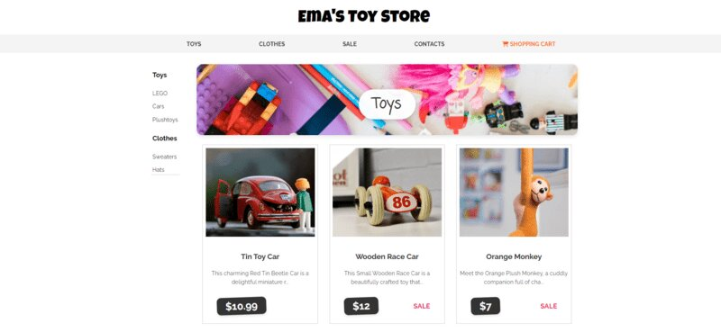

# Ema's Toy Store - E-shop

###Frontend

###Backend

Ema's Toy Store is an e-commerce platform built with JavaScript, CSS, and EJS, offering a seamless shopping experience for users looking to browse and purchase a variety of toys. The platform includes:

## Main Features

- A dynamic storefront where users can view and filter products.
- A MongoDB-powered backend for storing and retrieving product data.
- A custom dashboard for administrators to manage the store, update products, and view sales data.
- A product editing form, allowing easy updates to product details such as name, price, and description.

The store efficiently handles CRUD operations (Create, Read, Update, Delete) on products, making it easy to maintain up-to-date inventory and product offerings.
